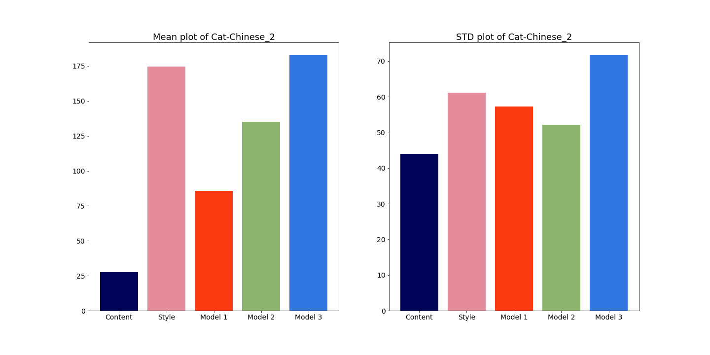
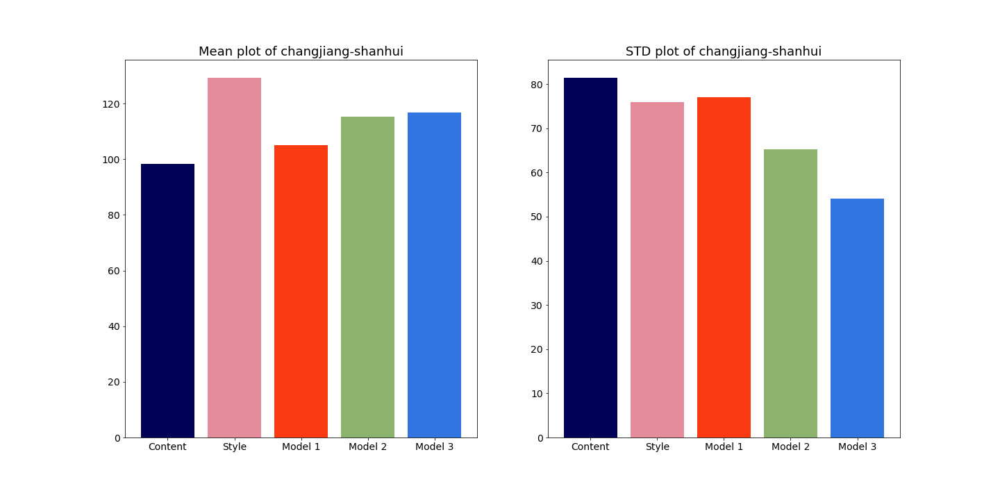
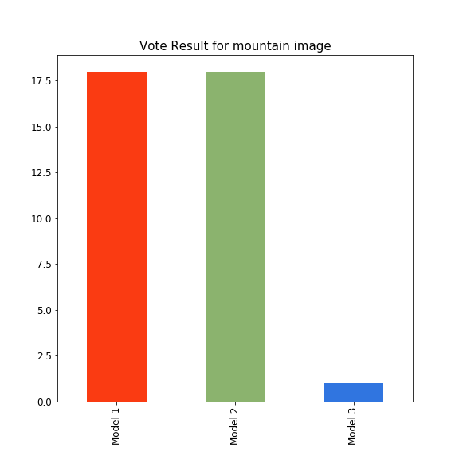
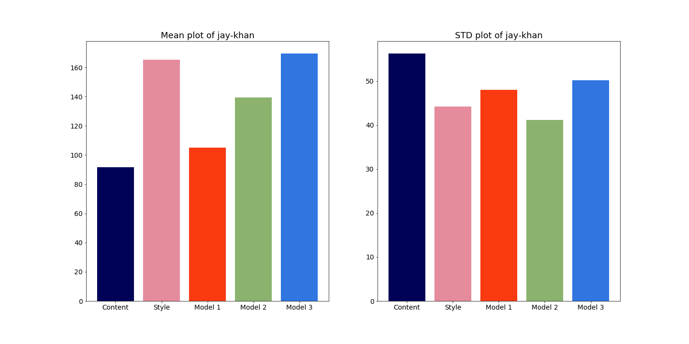
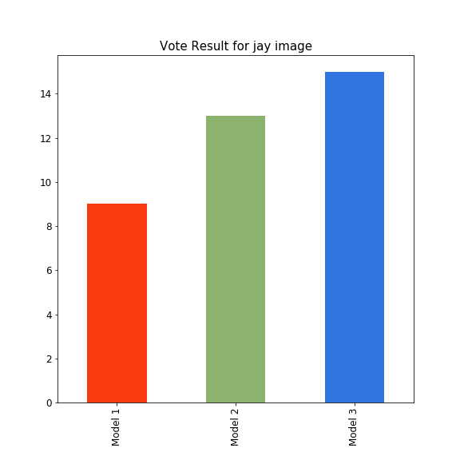
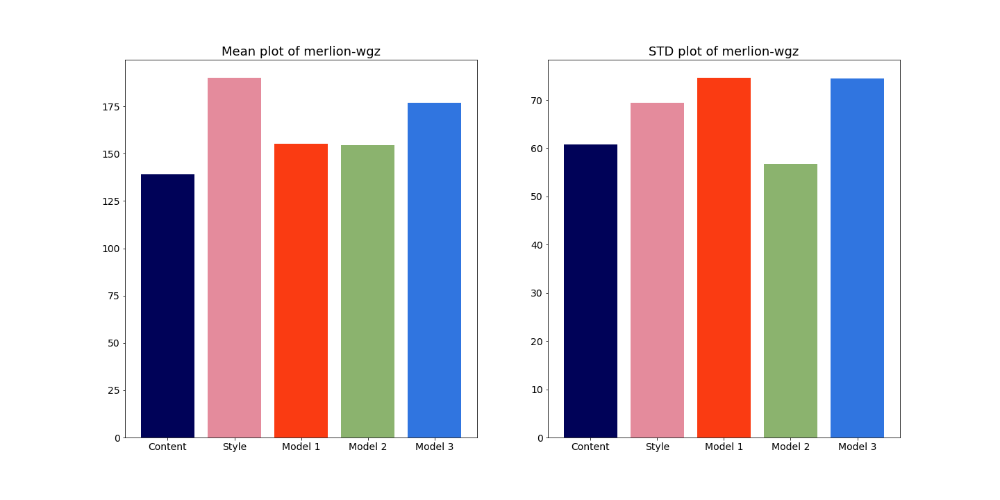
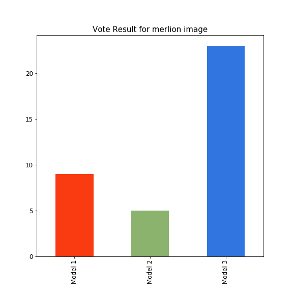
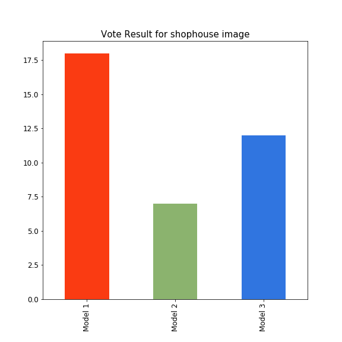

# Neural Style Transfer On Asian Painting

## Executive Summary

**Problem Statement:** Make Digital Content Generation Easy For Design Company

Designing good graphic design (especially in Chinese painting style) require skills and long duration of work in front of the computer. From the perspective of a design company, a graphic designing job a very talent dependent, which poses high risk in this manpower shortage and highly competitive times. By adopting deep learning technique such as Neural Style Transfer (NST), design company can automate the design process that produces consistent result which doesn't depend on individual design skillsets. 

3 different NST techniques are used for this project:

**Model 1:**   [Original NST with l_bfgs_b optimiser technique ](https://arxiv.org/abs/1508.06576) developed by Leon A. Gatys and his team in 2015  (Code adapted from Deep Learning with Python, written by François Chollet)

**Model 2:** Transfer Learning on VGG 19 + NST with Adam optimiser

(Code adapted from Tensorflow NST [tutorial](https://www.tensorflow.org/tutorials/generative/style_transfer))

**Model 3:**  [ Universal Style Transfer (Autoencoder + WCT)](https://arxiv.org/pdf/1705.08086.pdf)  developed by Li Yijun and his team in 2017 (Code adapted from [eridgd](https://github.com/eridgd/WCT-TF))

All 3 models are written in tensorflow. You can also run the code for this project via the google drive [LINK](https://drive.google.com/drive/folders/1zJmdOLw0uqpz7UkP1ZnJ35ORZD7Pbbyb?usp=sharing).

## Results

5 sets style transferred images are generated from 5 sets of content images & Chinese style images. Each sets of images were compared through Mean & STD comparison and surveying through google form.

### Cat & Chinese Painting

**Mean & STD Plot**

Model 3 has the closest mean when compared to the mean of the style image, which explains why model 3 transferred the closest colour and style compared to style image.

**Survey Result**

The survey result shows that model 3 is the most preferred generated image among the 3 model.

### Changjiang & Shangshui Painting

**Mean & STD Plot**

Model 1 has mean closer to the content image, and model 2 has a more balanced mean between style and content which are also reflected in the generated image. 

**Survey Result**

Model 1 & 2 has a tie over this set of images.

### Jay & Khan

**Mean & STD Plot**

Model 3 has the closest mean to the style image, which can be seen from the generated image from the similarity in colour and style.

**Survey Result**

The survey result shows that model 3 is the most preferred generated image among the 3 model.

### Merlion & WGZ

**Mean & STD Plot**

Model 3 has the closest mean to style image as seen from the generated image. Model 1 & 2 maintained more of the content image as seen from the mean of both images. 

**Survey Result**

The survey result shows that model 3 is the most preferred generated image among the 3 model.

### Shophouse & WGZ2

**Mean & STD Plot**

**Survey Result**

The survey result shows that model 1 is the most preferred generated image among the 3 model.

## Conclusion & Recommendation

| Model 1 | Model 2 | Model 3 |
| ------- | ------- | ------- |
| 2 Votes | 1 Vote  | 3 Votes |

Model 3: Universal Style Transfer are the most preferred NST technique among the 3 models, with the given 5 sets of images generated. The key feature of the technique in model 3 are the abilities to retain the content image (without colour & style) and transfer the style effectively into the content image. However, the model has its limitation and is not able to transfer all kind of style images effectively without taking time to conduct many trial & error testing. Nevertheless, with only 1 month of learning NST and only 3 months into data science, I am happy with the result achieved from the 3 model I have built. 

**Recommendation For Improvement**

1. Include more techniques to control the style transfer (e.g spatial, masking, luminence)
2. Improve image resolutions for high quality printing
3. Optimise model for GPU
4. Real time NST for video/webcam 

## Acknowledgement

I would like to thank my instructor, [Divya](https://www.linkedin.com/in/venkatramandivya/), in General Assembly (GA) for making this project possible. without her teaching & guidance in the fundamentals of data science, I would not have be able to understand deep learning in just 3 months. I would also like to thanks Ryan & Jin Howe, the teaching assistant of GA for their helpful guidance. 